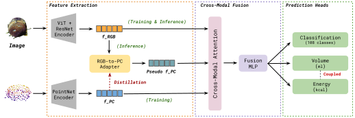

# PortionNet: Distilling 3D Geometric Knowledge for Food Nutrition Estimation

[](https://arxiv.org/abs/2512.22304)
[](https://www.python.org/downloads/)
[](https://pytorch.org/)

Official PyTorch implementation of **PortionNet**, a novel cross-modal knowledge distillation framework for accurate food nutrition estimation from single RGB images.

> **PortionNet: Distilling 3D Geometric Knowledge for Food Nutrition Estimation**  
> Darrin Bright, Rakshith Raj, Kanchan Keisham  
> Vellore Institute of Technology  
> *Accepted at CVIS 2025 - 11th Annual Conference on Vision and Intelligent Systems*  
> *arXiv preprint arXiv:2512.22304, 2025*

## Overview

PortionNet addresses the challenge of accurate food nutrition estimation from single RGB images by learning 3D geometric features from point clouds during training while requiring only RGB images at inference.

### Architecture

<p align="center">
  
</p>

*Figure 1: Overview of the PortionNet framework. During training, the model uses both RGB images and point clouds with cross-modal knowledge distillation. At inference, only RGB images are required.*

## Installation

### Requirements

- Python 3.8+
- PyTorch 2.0+
- CUDA 11.0+ (for GPU training)

### Setup

```bash
git clone https://github.com/darrinbright/PortionNet.git
cd PortionNet

conda create -n portionnet python=3.8
conda activate portionnet

pip install -r requirements.txt
pip install open3d
```

## Dataset Preparation

### MetaFood3D

1. Download the MetaFood3D dataset from [here](https://lorenz.ecn.purdue.edu/~food3d/)
2. Extract and organize as follows:

```
MetaFood3D/
├── RGB/
│   ├── apple/
│   │   ├── apple_1.png
│   │   └── ...
│   └── ...
├── Point_Cloud/
│   ├── apple/
│   │   ├── apple_1.ply
│   │   └── ...
│   └── ...
└── _MetaFood3D_new_complete_dataset_nutrition_v2.xlsx
```

### SimpleFood45

Download SimpleFood45 from [here](https://lorenz.ecn.purdue.edu/~gvinod/simplefood45/#:~:text=It%20contains%20images%20of%2045,%2C%20weight%2C%20and%20energy%20content) and organize similarly.

## Training

### Basic Training

```bash
python src/train.py \
  --data_dir /path/to/MetaFood3D \
  --excel_path /path/to/MetaFood3D/_MetaFood3D_new_complete_dataset_nutrition_v2.xlsx \
  --output_dir ./outputs \
  --epochs 25 \
  --batch_size 16 \
  --seed 7
```

### Multi-Seed Training

For reproducible results as reported in the paper:

```bash
# Seed 7
python src/train.py --data_dir /path/to/MetaFood3D --excel_path /path/to/excel --seed 7 --output_dir ./outputs/seed7

# Seed 13
python src/train.py --data_dir /path/to/MetaFood3D --excel_path /path/to/excel --seed 13 --output_dir ./outputs/seed13

# Seed 2023
python src/train.py --data_dir /path/to/MetaFood3D --excel_path /path/to/excel --seed 2023 --output_dir ./outputs/seed2023
```

### Key Hyperparameters

- `--rgb_only_ratio`: Proportion of batches trained in RGB-only mode (default: 0.3)
- `--lambda_distill`: Weight for distillation loss (default: 0.5)
- `--lambda_reg`: Weight for regression loss (default: 0.1)

## Evaluation

### Evaluate on MetaFood3D

```bash
# RGB-only mode (inference mode)
python src/evaluate.py \
  --data_dir /path/to/MetaFood3D \
  --excel_path /path/to/excel \
  --checkpoint ./outputs/best_model_seed7.pt \
  --mode rgb_only \
  --output_file results_rgb.json

# Multimodal mode (with point clouds)
python src/evaluate.py \
  --data_dir /path/to/MetaFood3D \
  --excel_path /path/to/excel \
  --checkpoint ./outputs/best_model_seed7.pt \
  --mode multimodal \
  --output_file results_multimodal.json
```

### Cross-Dataset Evaluation on SimpleFood45

```bash
python src/evaluate.py \
  --data_dir /path/to/SimpleFood45 \
  --excel_path /path/to/SimpleFood45/labels.xlsx \
  --checkpoint ./outputs/best_model_seed7.pt \
  --mode rgb_only \
  --num_classes 12 \
  --output_file results_simplefood45.json
```

## Citation

If you find this work useful, please cite our paper:

```bibtex
@article{bright2025portionnet,
  title={PortionNet: Distilling 3D Geometric Knowledge for Food Nutrition Estimation},
  author={Bright, Darrin and Raj, Rakshith and Keisham, Kanchan},
  journal={arXiv preprint arXiv:2512.22304},
  year={2025}
}
```

## Contact

For questions or issues:  
Email: darrin.bright2022@vitstudent.ac.in
